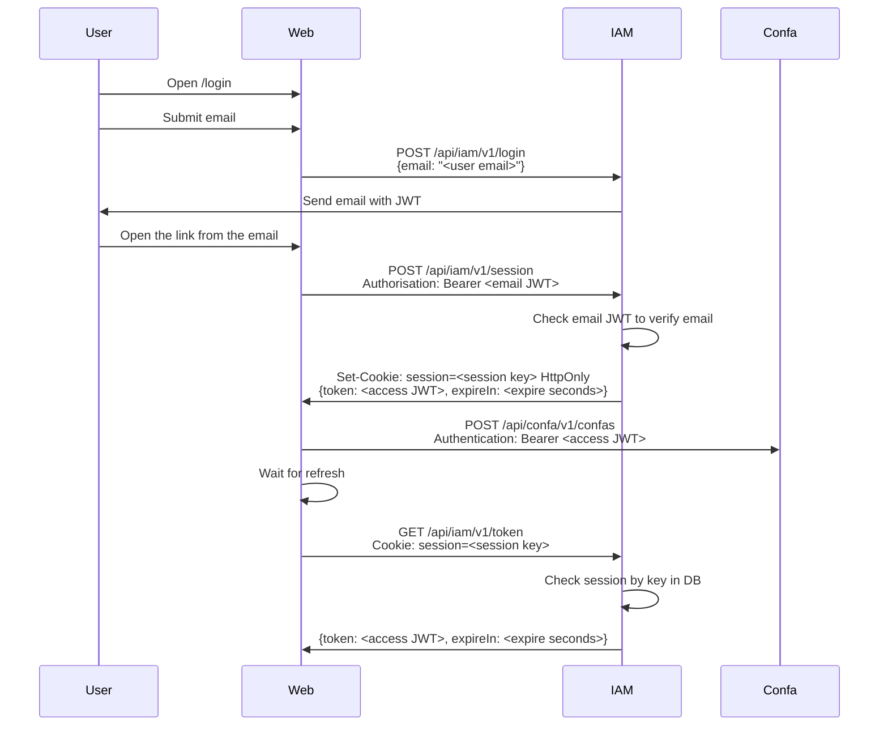

## Authentication scheme


## Generating keys
Auth uses ECDSA for signing. To generate private / public keys run:
```bash
openssl ecparam -name prime256v1 -genkey -noout -out private-key.pem
openssl ec -in private-key.pem -pubout -out public-key.pem
```
